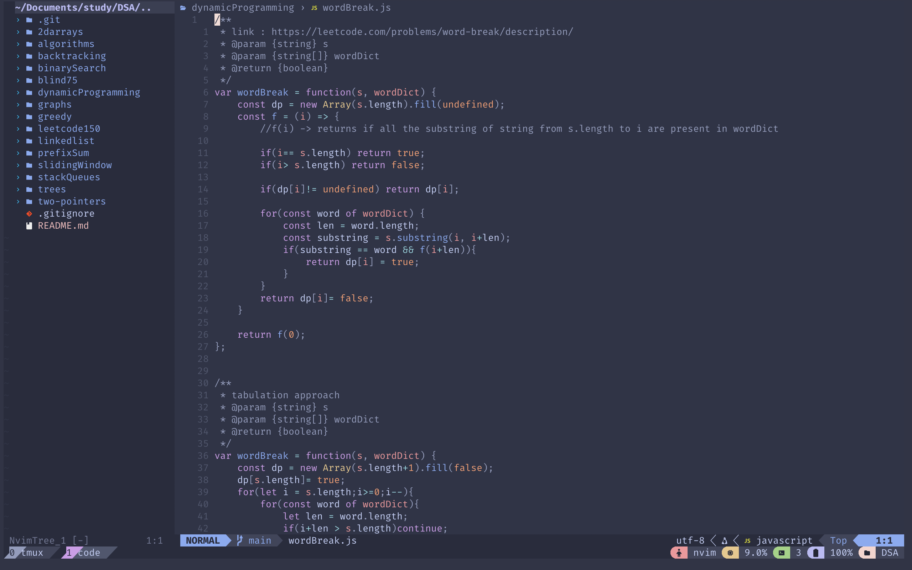
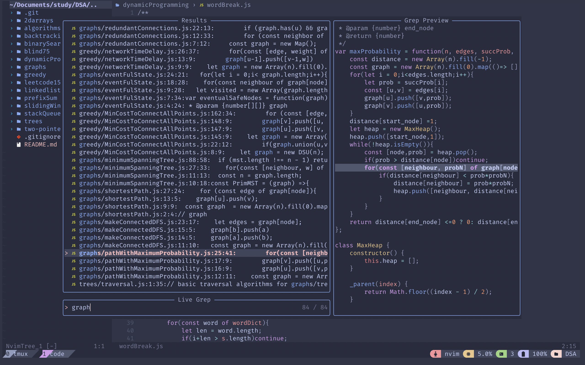
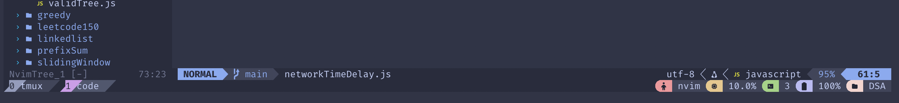
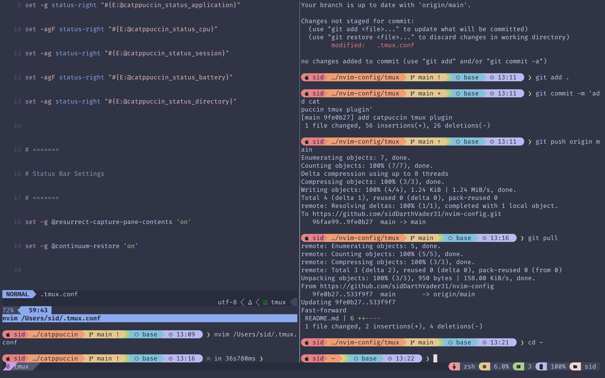

# 🚀 My Neovim & Tmux Configuration for Optimized Workflow

A modern, performance-focused Neovim configuration seamlessly integrated with **tmux** and **Catppuccin theming**. Designed for **backend developers** and **power users** who prioritize productivity, speed, and beautiful terminal workflows. This setup is optimized for JavaScript/TypeScript development with complete tmux integration.


## ✨ Features

- **🔥 Fast Startup**: Lazy loading with `lazy.nvim` for optimal performance
- **🎨 Beautiful UI**: Catppuccin colorscheme with enhanced status line
- **🧠 Smart LSP**: Full Language Server Protocol support for 20+ languages
- **🔍 Powerful Search**: Telescope integration with fuzzy finding and live grep
- **🌳 File Management**: Enhanced file explorer with custom icons and shortcuts
- **⚡ Terminal Integration**: Built-in terminal toggle and seamless tmux navigation
- **📝 Code Completion**: Intelligent autocompletion with snippets
- **🔧 Git Integration**: Built-in git signs, blame, and telescope git commands
- **🎯 Productivity Tools**: Auto-pairs, surround, comments, and more
- **🖥️ Tmux Integration**: Complete tmux configuration with Catppuccin theming

## 📸 Screenshots

### 💻 Neovim Coding Environment

*Full coding environment with LSP, file explorer, and Catppuccin theme*

### 🔍 Fuzzy Finding & Search

*Telescope fuzzy finder with live preview and file search capabilities*

### 🖥️ Tmux Integration with Catppuccin

*Beautiful tmux status line with Catppuccin theming, showing CPU, battery, session info*

### 🪟 Tmux Panes & Window Management

*Multiple tmux panes with seamless Neovim integration and consistent theming*

### 🔧 Git Integration

*Git integration with gitsigns, blame, and telescope git commands*

## 🚀 Quick Start

### Prerequisites
- Neovim >= 0.8.0
- Tmux >= 3.2.0
- Git
- A [Nerd Font](https://www.nerdfonts.com/) (recommended: FiraCode Nerd Font)
- Node.js (for LSP servers)
- ripgrep (for telescope live grep)

### Installation

1. **Backup your existing config** (if any):
   ```bash
   mv ~/.config/nvim ~/.config/nvim.backup
   mv ~/.tmux.conf ~/.tmux.conf.backup
   ```

2. **Clone this repository**:
   ```bash
   git clone https://github.com/sidDarthVader31/nvim-config.git ~/.config/nvim
   ```

3. **Copy tmux configuration** (optional):
   ```bash
   cp ~/.config/nvim/tmux/.tmux.conf ~/.tmux.conf
   ```

4. **Start Neovim**:
   ```bash
   nvim
   ```

5. **Install plugins**: Lazy.nvim will automatically install all plugins on first startup.

6. **Install LSP servers**: Open Mason with `:Mason` and install language servers for your languages.

## 📁 Project Structure

```
nvim-config/
├── init.lua                 # Entry point - bootstraps the config
├── lua/sid/                 # Core configuration modules
│   ├── core/               # Core Neovim settings
│   │   ├── colorscheme.lua # Catppuccin theme configuration
│   │   ├── keymaps.lua     # Global key mappings
│   │   └── options.lua     # Neovim options & settings
│   ├── plugins/            # Plugin configurations
│   │   ├── lsp/           # LSP related configurations
│   │   ├── catppuccin.lua # Theme customization
│   │   ├── nvim-cmp.lua   # Autocompletion setup
│   │   ├── telescope.lua  # Fuzzy finder config
│   │   ├── nvim-tree.lua  # File explorer setup
│   │   ├── toggleterm.lua # Terminal integration
│   │   ├── gitsigns.lua   # Git integration
│   │   └── ...            # Other plugin configs
│   └── lazy-setup.lua      # Plugin manager setup & lazy loading
├── assets/                 # Screenshots and documentation
├── tmux/                  # Tmux configurations with Catppuccin
└── lazy-lock.json         # Plugin version lock file
```

## ⚡ Key Mappings

### General Navigation
| Key | Mode | Action |
|-----|------|--------|
| `<Space>` | Normal | Leader key |
| `jk` | Insert | Exit insert mode |
| `<leader>nh` | Normal | Clear search highlights |
| `<C-h/j/k/l>` | Normal | Navigate between tmux/vim panes |

### File Management  
| Key | Mode | Action |
|-----|------|--------|
| `<leader>e` | Normal | Toggle file explorer (NvimTree) |
| `<leader>ff` | Normal | Find files (Telescope) |
| `<leader>fs` | Normal | Live grep search |
| `<leader>fc` | Normal | Find word under cursor |
| `<leader>fb` | Normal | Find buffers |
| `<leader>fh` | Normal | Find help tags |

### Window Management
| Key | Mode | Action |
|-----|------|--------|
| `<leader>sv` | Normal | Split window vertically |
| `<leader>sh` | Normal | Split window horizontally |
| `<leader>se` | Normal | Make splits equal width |
| `<leader>sx` | Normal | Close current split |
| `<leader>sm` | Normal | Maximize/minimize current window |

### Terminal & Git
| Key | Mode | Action |
|-----|------|--------|
| `<leader>tt` | Normal | Toggle terminal |
| `<C-\>` | Normal/Terminal | Toggle terminal (alternative) |
| `<leader>gb` | Normal | Toggle git blame |
| `<leader>gc` | Normal | Git commits (Telescope) |
| `<leader>gs` | Normal | Git status (Telescope) |

### LSP Features
| Key | Mode | Action |
|-----|------|--------|
| `<leader>rs` | Normal | Restart LSP server |
| `gd` | Normal | Go to definition |
| `gD` | Normal | Go to declaration |
| `gi` | Normal | Go to implementation |
| `gr` | Normal | Go to references |
| `K` | Normal | Show hover documentation |
| `<leader>lm` | Normal | Open Mason (LSP installer) |

## 🔌 Plugin Ecosystem

### Core Plugins
- **[lazy.nvim](https://github.com/folke/lazy.nvim)** - Modern plugin manager with lazy loading
- **[catppuccin](https://github.com/catppuccin/nvim)** - Soothing pastel theme  
- **[telescope.nvim](https://github.com/nvim-telescope/telescope.nvim)** - Fuzzy finder and picker
- **[nvim-tree.lua](https://github.com/nvim-tree/nvim-tree.lua)** - File explorer sidebar

### Development Tools
- **[nvim-lspconfig](https://github.com/neovim/nvim-lspconfig)** - LSP client configurations
- **[mason.nvim](https://github.com/williamboman/mason.nvim)** - LSP/DAP/Linter installer
- **[nvim-cmp](https://github.com/hrsh7th/nvim-cmp)** - Autocompletion engine
- **[nvim-treesitter](https://github.com/nvim-treesitter/nvim-treesitter)** - Syntax highlighting and parsing
- **[null-ls.nvim](https://github.com/jose-elias-alvarez/null-ls.nvim)** - Formatting and linting

### Productivity Enhancers
- **[toggleterm.nvim](https://github.com/akinsho/toggleterm.nvim)** - Terminal integration
- **[gitsigns.nvim](https://github.com/lewis6991/gitsigns.nvim)** - Git decorations
- **[vim-tmux-navigator](https://github.com/christoomey/vim-tmux-navigator)** - Seamless tmux/vim navigation
- **[nvim-autopairs](https://github.com/windwp/nvim-autopairs)** - Auto close brackets
- **[Comment.nvim](https://github.com/numToStr/Comment.nvim)** - Smart commenting

### UI & Aesthetics
- **[lualine.nvim](https://github.com/nvim-lualine/lualine.nvim)** - Statusline
- **[noice.nvim](https://github.com/folke/noice.nvim)** - Enhanced UI notifications
- **[nvim-web-devicons](https://github.com/nvim-tree/nvim-web-devicons)** - File type icons

## 🖥️ Tmux Integration Features

### Catppuccin Tmux Theme
- **Consistent Theming**: Matches Neovim's Catppuccin colors perfectly
- **Status Modules**: CPU usage, battery, session info, uptime display
- **Window Management**: Beautiful window tabs with rounded separators
- **Seamless Navigation**: `Ctrl+h/j/k/l` works between vim splits and tmux panes

### Tmux Key Bindings
- **Prefix**: `Ctrl-a` (customizable)
- **Window Creation**: `prefix + c` with custom naming
- **Pane Splitting**: `prefix + |` (vertical), `prefix + -` (horizontal)
- **Pane Resizing**: `prefix + h/j/k/l` for resizing
- **Session Management**: Built-in resurrection and persistence

## 🎨 Customization

### Colorscheme
The configuration uses **Catppuccin** theme with custom highlights. To change themes:

1. Edit `lua/sid/core/colorscheme.lua`
2. Replace `"catppuccin"` with your preferred theme
3. Update the lazy.nvim setup in `lazy-setup.lua`
4. Update tmux theme accordingly

### Adding Plugins
1. Add plugin spec to `lua/sid/lazy-setup.lua`
2. Create configuration file in `lua/sid/plugins/`
3. Restart Neovim to install

### Key Mappings
- Global mappings: `lua/sid/core/keymaps.lua` 
- Plugin-specific mappings: Individual plugin config files or lazy.nvim specs

### Tmux Customization
- Main config: `tmux/.tmux.conf`
- Theme options: Catppuccin flavor, status modules, separators
- Key bindings: Fully customizable prefix and shortcuts

## ⚙️ Performance Features

- **Lazy Loading**: Plugins load only when needed
- **Optimized Startup**: Disabled unnecessary built-in plugins
- **Efficient Caching**: Lua module caching enabled
- **Smart Event Triggers**: Plugins load on specific events (InsertEnter, BufReadPre, etc.)
- **Tmux Performance**: Optimized status line updates and plugin loading

## 🔧 Language Support

Pre-configured for:
- **JavaScript/TypeScript** (Primary focus)
- **Lua** (Neovim configuration)
- **JSON, HTML, CSS**
- **Markdown**
- **Shell scripting**
- **Python, Go, Rust** (via Mason)

Additional language servers can be installed via `:Mason`.

## 🤝 Complete Tmux Integration

This configuration provides a **complete terminal workflow**:

### Navigation
- Seamless movement between Neovim splits and tmux panes
- Consistent key bindings across both environments
- Smart window/pane management

### Visual Consistency  
- Unified Catppuccin theming across Neovim and tmux
- Matching colors, fonts, and visual elements
- Professional, distraction-free environment

### Workflow Features
- Session persistence and restoration
- Integrated terminal within Neovim
- Git workflow optimization
- Status line information at a glance

## 🐛 Troubleshooting

### Plugins Not Loading
```bash
# Clear plugin cache and reinstall
rm -rf ~/.local/share/nvim/lazy
nvim
```

### LSP Not Working
1. Open `:Mason` and install required language servers
2. Check `:LspInfo` for active servers
3. Restart LSP: `<leader>rs`

### Tmux Issues
- Ensure tmux version 3.2+
- Install TPM: `git clone https://github.com/tmux-plugins/tpm ~/.tmux/plugins/tpm`
- Install plugins: `prefix + I`

### Terminal Issues
- Ensure your terminal supports true colors
- Install a Nerd Font for proper icon display
- Set `TERM=tmux-256color` in your shell

## 🤝 Contributing

Feel free to open issues or pull requests if you have suggestions for improvements!

## 📄 License

This configuration is available under the MIT License. See the repository for details.

---

**Happy coding with beautiful terminals!** 🎉

> Built with ❤️ for productive development workflows and terminal enthusiasts
